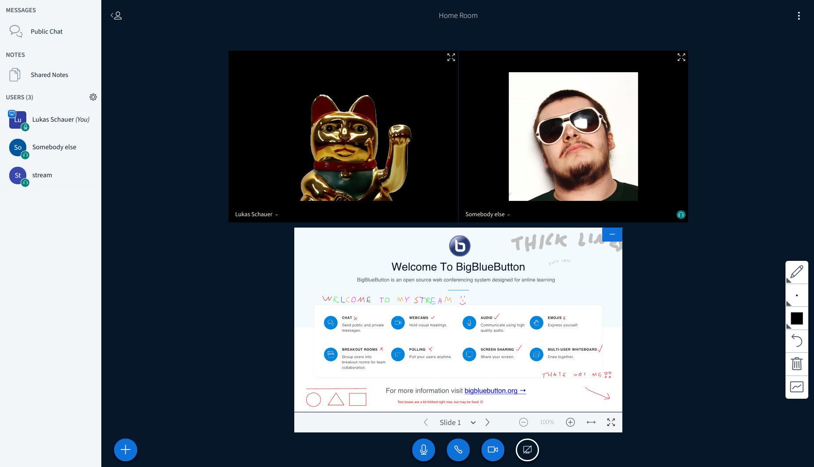
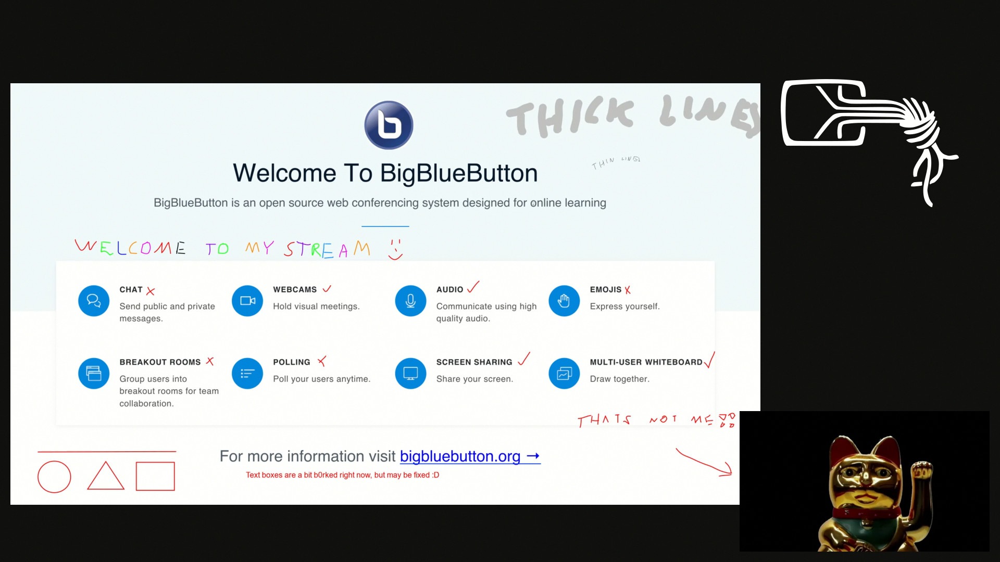

# BBB Streamer NG?

Makes a conference like this...

...streamable like this!

I also recorded a small video showing the basic features: https://www.youtube.com/watch?v=u9pTmzowIPc

Big Blue Button streaming without pressing a virtual camera against a remote controlled webbrowser..

Heavily work-in-progress, but kinda functional.

The whiteboard is definitively the hardest part to get right. Everything else just kinda depends on
gstreamer not breaking every 5 minutes :D

Example usage: `python test.py your.bbb.server room-id-from-greenlight rtmp://server/app/path?auth=foobar`

Or alternatively `docker run -t -i --rm=true lukas2511/bbb-streaming your.bbb.server room-id-from-greenlight rtmp://server/app/path?auth=foobar`

Working:

- Capturing audio
- Capturing all cameras
- Capturing screen captures
- Generating presentation canvas (including annotations) and converting it into an internal video stream
- Automatic switching between presentation and screenshare
- Simple side-by-side scene with exactly 1 active webcam and the presentation/screenshare
- Tracking camera of active speaker
- Background image for streams
- Selection of multiple scenes (side-by-side, fullscreen cam/presentation) using chat commands (`!view <sbs|pip|cam|pres>`)

Output is streamed using rtmp for now. How this is implemented will probably change.

Todo:

- Fixing the gstreamer webrtc video glitches (recovery on packetloss is b0rked, currently enabling slight fec and requesting a keyframe every second)
- Support different camera selections (follow-speaking/follow-presenter/manual selection)
- Lots of error handling + recovery foo
- Finishing the todo list
